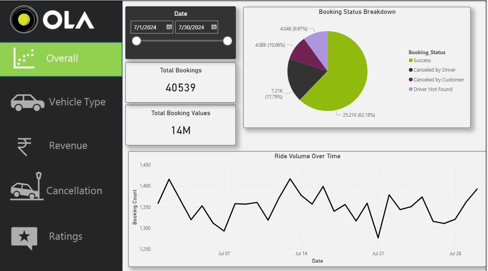
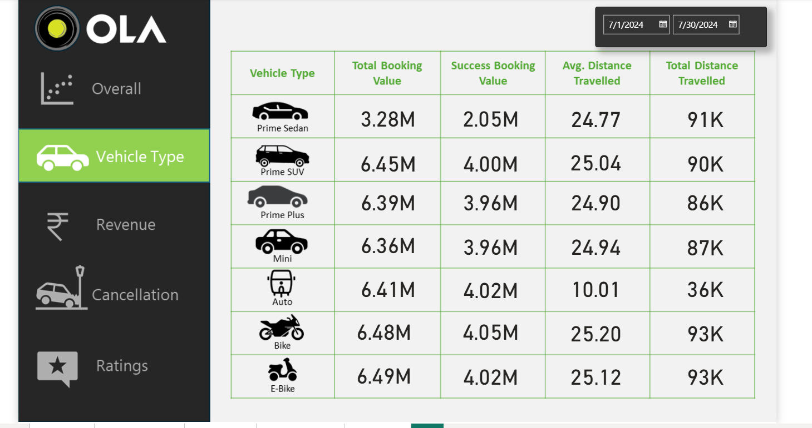
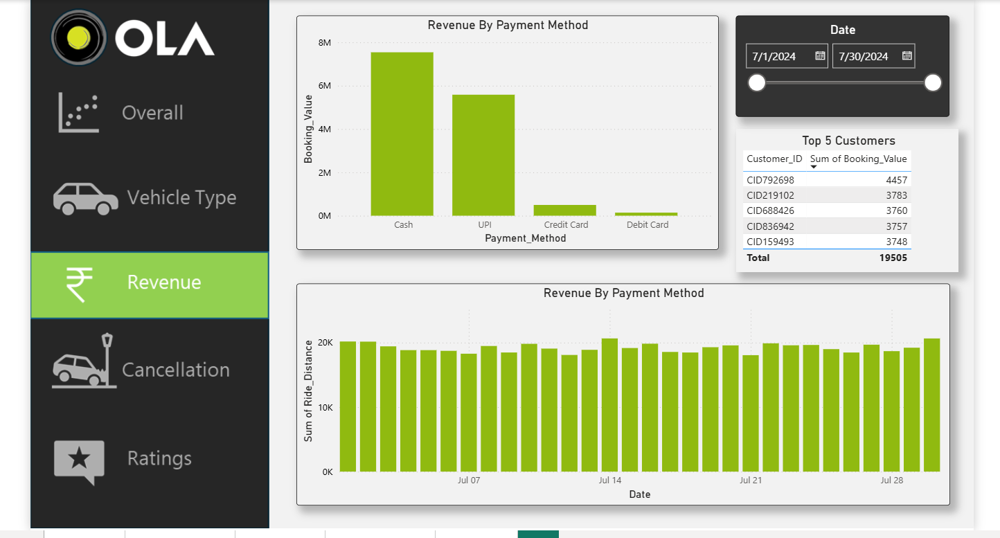
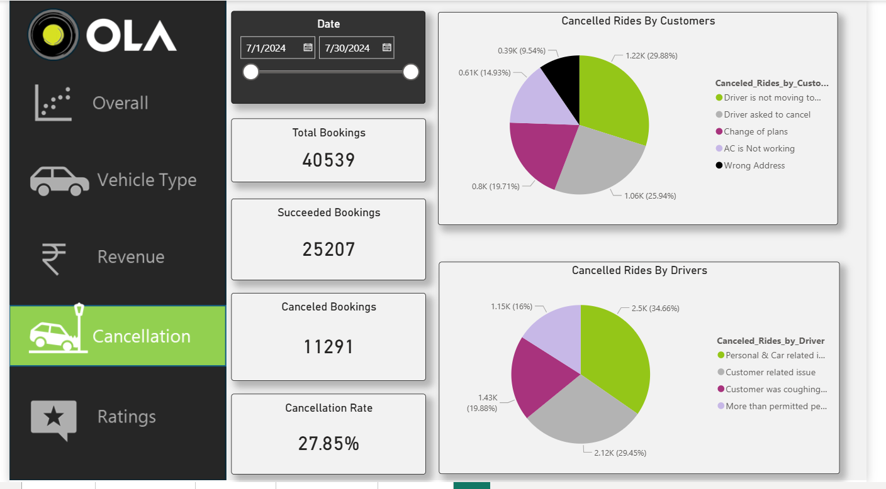
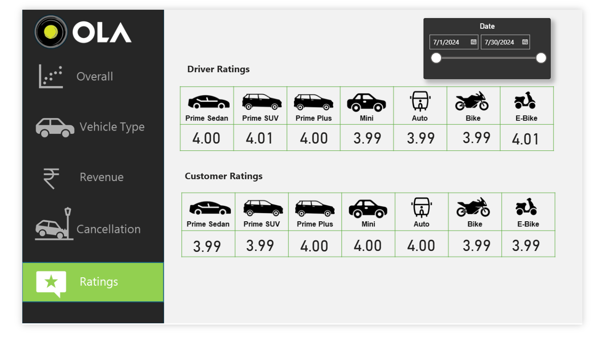

# Ola Power BI Dashboard

## Project Overview

This project presents an interactive Power BI dashboard built using Ola ride booking data.

The dashboard provides insights into:

* Total Bookings
* Revenue Analysis
* Vehicle Type Performance
* Cancellation Analysis
* Customer Ratings
* Driver Ratings

## Tools Used

* Power BI Desktop
* Microsoft Excel
* CSV Dataset

## Dashboard Pages

* Overall Dashboard
* Vehicle Type Dashboard
* Revenue Dashboard
* Cancellation Dashboard
* Ratings Dashboard

## Files Included

### Power BI File

* ola_Dashboard.pbix

### Datasets

* ola_bookings.csv (Cleaned Dataset)
* row_ola_Bookings.csv (Raw Dataset)

### Dashboard Screenshots

* overall.png
* Vehicle_type.png
* Revenue.png
* cancellation.png
* Ratings.png

## Key Insights

* Booking Trends
* Revenue Distribution
* Cancellation Rate Analysis
* Vehicle Performance Comparison
* Customer and Driver Satisfaction Metrics

## Dashboard Preview

### Overall Dashboard

### Vehicle Type Dashboard

### Revenue Dashboard

### Cancellation Dashboard

### Ratings Dashboard

